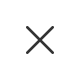
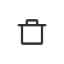
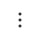
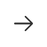
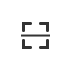

# NavigationBar 新版导航栏

## 简介

| 基本信息  |                                                                                                          |
| --------- | -------------------------------------------------------------------------------------------------------- |
| 中文名称  | 米家插件导航栏                                                                                           |
| 描述      | 新版的米家插件导航栏，根据最新的米家插件设计规范开发<br />按照设计规范要求，推荐插件开发者使用新版导航栏 |
| 位置      | `miot/ui/NavigationBar`                                                                                  |
| SDK_Level | `SDK_10021`                                                                                              |
| 注意事项  | \                                                                                                        |

## 用法

```jsx
import React from 'react';
import { Text } from 'react-native';
import { NavigationBar } from 'miot-design';

export default () => (
  <>
    <NavigationBar
      backgroundColor="black"
      type={NavigationBar.TYPE.DARK}
      left={[
        {
          key: NavigationBar.ICON.BACK,
          // onPress: (_) => this.props.navigation.goBack(),
        },
        {
          key: NavigationBar.ICON.CLOSE,
          onPress: (_) => console.log('onPress'),
        },
      ]}
      right={[
        {
          key: NavigationBar.ICON.COLLECT,
          disable: true,
          onPress: (_) => console.log('onPress'),
        },
        {
          key: NavigationBar.ICON.MORE,
          showDot: true,
          onPress: (_) => console.log('onPress'),
        },
      ]}
      title="标题"
      subtitle="副标题"
      onPressTitle={(_) => console.log('onPressTitle')}
    />
  </>
);
```

## API

| Name            | Type                             | Description                                                                                                                                                                                                                               |
| --------------- | -------------------------------- | ----------------------------------------------------------------------------------------------------------------------------------------------------------------------------------------------------------------------------------------- |
| type            | <code>string</code>              | 导航栏类型：<br />`NavigationBar.TYPE.DARK` 表示深色背景白色文字<br />`NavigationBar.TYPE.LIGHT` 相反                                                                                                                                     |
| backgroundColor | <code>object</code>              | 导航栏背景色                                                                                                                                                                                                                              |
| left            | <code>array&lt;object&gt;</code> | 左侧按钮的集合，最多显示两个，多余无效，每个按钮用一个`object`表示<br /> {<br />key // 按钮的 key，在`NavigationBar.ICON`中枚举定义<br />disable // 是否禁用按钮<br />showDot // 是否显示小红点<br />onPress // 点击按钮的回调函数<br />} |
| right           | <code>array&lt;object&gt;</code> | 右侧按钮的集合，最多显示两个，多余无效，每个按钮用一个`object`表示 `{ key, disable, showDot, onPress }`                                                                                                                                   |
| title           | <code>string</code>              | 中间的标题                                                                                                                                                                                                                                |
| titleStyle      | <code>object</code>              | 10040 新增 中间的标题的样式 - 目前支持 fontSize                                                                                                                                                                                           |
| subtitle        | <code>string</code>              | 中间的副标题                                                                                                                                                                                                                              |
| subtitleStyle   | <code>object</code>              | 10040 新增 中间的副标题的样式 - 支持的属性有 fontSize, colorType 。colorType 是副标题的颜色，目前支持三种： normal '#666666', warning: '#f43f31' exception: '#f5a623'                                                                     |
| onPressTitle    | <code>string</code>              | 点击标题的事件                                                                                                                                                                                                                            |
| useOrientation  | <code>bool</code>                | 10048 新增 是否要支持横屏 默认 false                                                                                                                                                                                                      |

### NavigationBar.ICON 图标列表

| 枚举值                            | 中文描述      | 图标                                           | 说明                                                  |
| --------------------------------- | ------------- | ---------------------------------------------- | ----------------------------------------------------- |
| `NavigationBar.ICON.ADD`          | 添加          |           |
| `NavigationBar.ICON.BACK`         | 返回          |          | ❗️SDK_10040 更新为新版返回图标                       |
| `NavigationBar.ICON.CLOSE`        | 关闭          |         |
| `NavigationBar.ICON.COLLECT`      | 收藏/喜欢     |       |
| `NavigationBar.ICON.COMPLETE`     | 完成/确认     |      |
| `NavigationBar.ICON.DELETE`       | 删除          |        |
| `NavigationBar.ICON.DETAIL`       | 详情          |        |
| `NavigationBar.ICON.MORE`         | 更多          |          |
| `NavigationBar.ICON.NEXT`         | 下一步/下一页 |          |
| `NavigationBar.ICON.PROFILE`      | 个人中心/我的 |       |
| `NavigationBar.ICON.QR`           | 二维码/扫一扫 |            |
| `NavigationBar.ICON.SEARCH`       | 搜索          |        |
| `NavigationBar.ICON.SELECT_ALL`   | 全选          |    |
| `NavigationBar.ICON.SELECTED_ALL` | 全部选中      |  |
| `NavigationBar.ICON.SHARE`        | 分享          |         |
| `NavigationBar.ICON.EDIT`         | 编辑          |          | ❗️SDK_10040 新增                                     |
| `NavigationBar.ICON.RECORD`       | 记录          |          | ❗️SDK_10043 新增（图片不存在使用 edit.png 代替显示） |
| `NavigationBar.ICON.ORIENTATION`  | 设备方向      |   | ❗️SDK_10045 新增                                     |
| `NavigationBar.ICON.SAVE`         | 保存          |          | ❗️SDK_10049 新增                                     |

### 和`Titlebar` 对比

- 在原有图标基础上支持更多的图标（共 16 种），但不支持自定义图标，只能从 [NavigationBar.ICON](#navigationbaricon-图标列表) 中选择，图标样式也有改动
- 传参有改动，删除 `leftTextStyle/leftText/rightTextStyle/rightText/style`，增加 `left/right/backgroundColor`
- `type` 含义变更：之前 `dark` 表示白底黑字，容易误导，现在表示**深色背景白色文字**
- 考虑到某些语言不好兼容的情况，导航栏左右侧只支持图标，不再支持文字
- 导航栏高度固定，不允许更改，背景色仍然可以自定义
